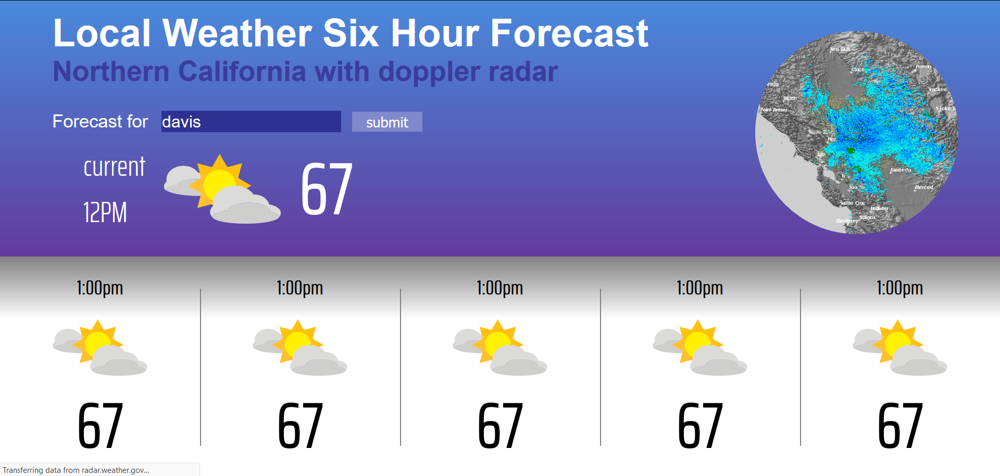
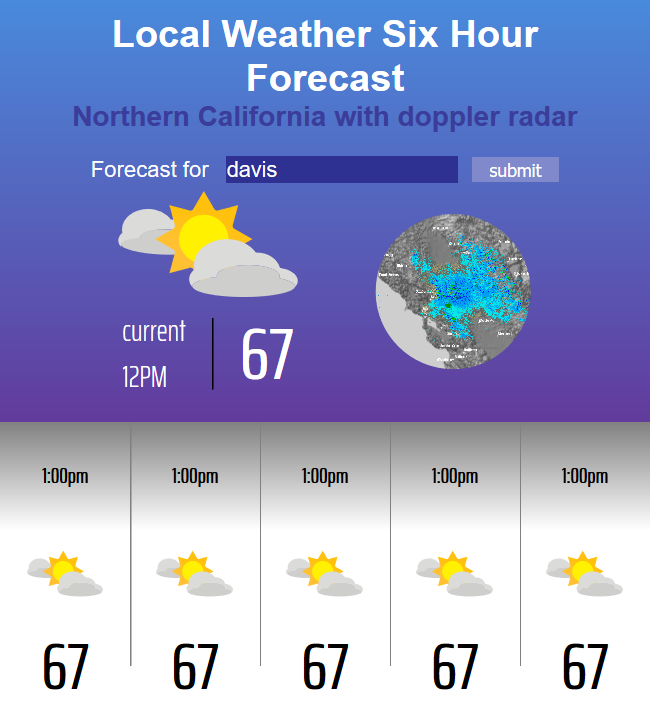
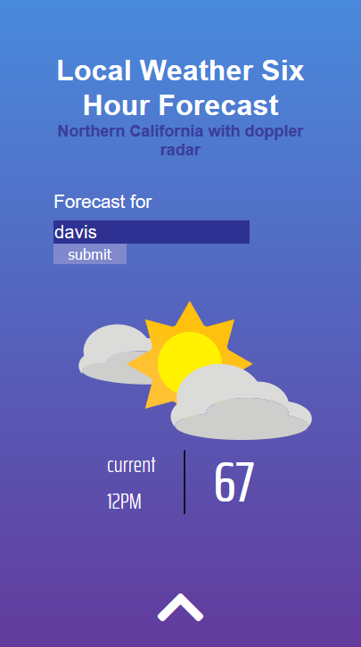
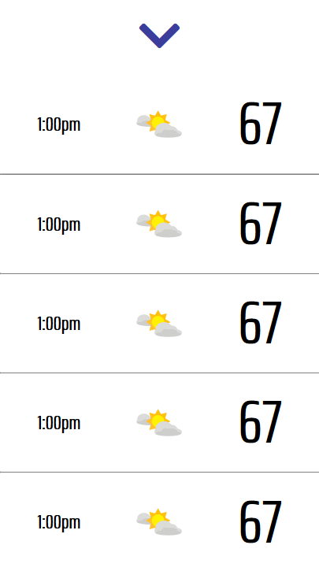

# Weather Application

### [Live Demo](http://karuns-weather-app.herokuapp.com/)

This is a weather application that uses **OpenWeatherMap Hourly Forcast API** to display weather for the weather submited.

In addition there is a doppler radar map that is used from the **National Weather Service**

The web application supports three different views

#### Web

#### Tablet

#### Mobile

